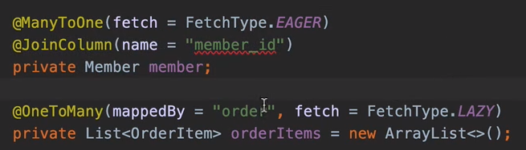

# 프로젝트 환경설정

## h2

- [h2-다운로드](https://www.h2database.com)
- h2/bin 폴더 진입
- h2 실행: `sh h2.sh`
- db 파일 생성(1회) : `jdbc:h2:~/{데이터베이스 이름}`
- home 디렉토리에 파일 `{데이터베이스 이름}.mv.db` 파일 생성 확인

- db 네트워크 접속 : `jdbc:h2:tcp://localhost/~/{데이터베이스 이름}`

## 같은 영속성 컨텍스트 안에서 아이디 값이 같으면 같은 엔티티로 식별

```java
    @Test
    @Transactional
    @Rollback(false)
    public void testMember(){
        //given
        Member member = new Member();
        member.setUsername("memberA");

        //when
        Long saveId = memberRepository.save(member);
        Member findMember = memberRepository.find(saveId);

        //then
        Assertions.assertThat(findMember).isEqualTo(member);
    }
```

## 쿼리 파라미터 로그 남기기

- `implementation 'com.github.gavlyukovskiy:p6spy-spring-boot-starter:1.5.6'`


# 도메인 분석 설계

## 도메인 모델과 테이블 설계

- 연관관계 공부가 필요해보임, JPA 기본편 봐야지..

- 연관관계 주인?
  - ex) 객체 변경 포인트 2곳, 테이블은 변경 포인트 1곳
- 상속관계 맵핑
  - `@Inheritance(strategy = InheritanceType.SINGLE_TABLE)`
  - `@DiscriminatorColumn(name ="dtype")`

- `다대다 관계` 를 맺을 때, 객체는 컬렉션 관계를 맺을 수 있지만, RDB는 불가능하기 때문에 중간 테이블이 필요하다.


Embeddable 쓰는 이유는 뭘까, 결과적으론 한 테이블에서 모두 관리하는거랑 동일한 결과인데, 필드가 많아지면 보기 힘드니까? 타고 들어가는게 더 복잡하지 않나?

```java
@Embeddable
@Getter @Setter
public class Address {

    private String city;
    private String street;
    private String zipcode;

}
```

## 모든 연관관계는 지연로딩으로 설정!

- `@OneToOne`, `@ManyToOne` 관계는 기본이 즉시 로딩(`EAGER`)


```
 @ManyToOne(fetch = FetchType.LAZY)
```

## 컬렉션은 필드에서 초기화 하자


## 테이블, 컬럼명 생성 전략

1. 논리명 생성
   1. 명시적으로 컬럼, 테이블명을 직접 적지 않으면 `ImplicitNamingStrategy` 사용
   2. `spring.jpa.hibernate.naming.implicit-strategy`
2. 물리명 적용
   1. 모든 논리명에 적용됨, 실제 테이블에 적용
   2. `spring.jpa.hibernate.naming.physical-strategy`

## Cascade

- 전파
  - 원래 영속화를 각각 해줘야 하지만 CascadeType All로 해주면 
  - 엔티티를 영속화할 때 포함하고 있는 엔티티도 같이 영속화해준다.


## 연관관계 메서드

- 까먹을 수 있음.


```java
    @Enumerated(EnumType.STRING)
    private OrderStatus status;

    // == 연관관계 편의 메서드  == //
    public void setMember(Member member){
        this.member = member;
        member.getOrders().add(this);
    }

    public void addOrderItem(OrderItem orderItem){
        orderItems.add(orderItem);
        orderItem.setOrder(this);
    }

    public void setDelivery(Delivery delivery){
        this.delivery = delivery;
        delivery.setOrder(this);
    }
```

# 애플리케이션 구현 준비

### 계층형 구조

- 컨트롤러, 서비스, 레포지토리, 도메인

### 개발 순서

1. 서비스, 레포지토리 계층 개발

2. 테스트케이스 작성 및 검증

3. 웹 계층 적용


# 회원 도메인 개발

## JPQL != SQL

- 차이 
  - SQL : 테이블 대상 쿼리
  - JPQL: 엔티티 객체 대상 쿼리

```java
  public List<Member> findAll() {
        return em.createQuery("SELECT m FROM Member m", Member.class).getResultList();
    }
```

## @Transactional

- 아직 잘 모르겠다. 공부 필요

```java
조회
@Transactional(readOnly = true)
public List<Member> findMembers(){
```

## @RequiredArgsConstructor

- final 필드 생성자 주입

## @PersistenceContext ==> @Autowired

- `EntityManager`는 원래 Autowired로 인젝션이 안되고, `@PersistenceContext`라는 표준 어노테이션이 있어야 인젝션이 가능하다.
- Spring Data JPA는 `@Autowired`도 인젝션이 되게끔 지원을 해줌.


## INSERT 문이 안나감.

- DataBase 트랜잭션이 커밋될 때, DB 인서트가 나가기 때문임.
- DB 전략마다 다르지만, GeneratedValue 전략에서는 안나감.
- Spring에서 @Transactional은 기본적으로 RollBack을 해버림.

```java
@Test
public void 회원가입(){
    // given
    Member member = new Member();
    member.setName("Park");
    // when
    Long savedId = memberService.join(member);

    // then
    assertEquals(member, memberRepository.findOne(savedId));
}
```


```
TransactionContext: Rolled back transaction for test
```

###  그래도 보고 싶다면

1. 롤백을 false 하거나

```java
    @Test
    @Rollback(false)
    public void 회원가입(){
```

2. EntityManager를 주입받고, Insert()메서드 아래에 flush() 메서드 실행

```java
    @Autowired EntityManager em;

    @Test
    public void 회원가입(){
		...
        Long savedId = memberService.join(member);
        em.flush();
        ...
```

## @Test(expected = IllegalStateException.class)


## 운영코드와 테스트 코드의 application.properites 분리 가능

- application에 별도의 설정이 없으면, 스프링 부트가 `H2 메모리 모드`와 `create-drop`으로 동작함.
